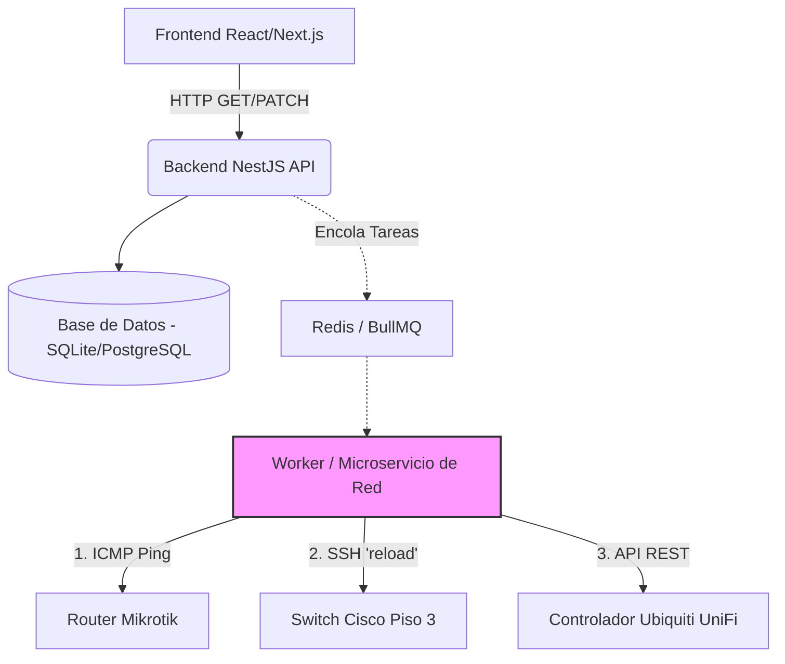

# Viabilidad en Producción: Monitoreo y Gestión de Redes

Has tocado un punto arquitectónico crítico. Lo que estamos construyendo en este prototipo es una **simulación (Mock)**, pero llevarlo a **Producción (Vida Real)** en la clínica es un proyecto fascinante y **totalmente viable**. 

De hecho, los sistemas profesionales de monitoreo (como *Zabbix, PRTG, o SolarWinds*) se basan exactamente en los mismos principios que implementarías en tu backend (NestJS). Aquí tienes la ruta técnica y los desafíos reales para estar preparado en el futuro.

---

## 1. ¿Es viable hacer Ping (ICMP) desde un Servidor Web?

**Sí, es posible, pero con consideraciones de seguridad y rendimiento.**

### ¿Cómo se hace en la vida real (Node.js/NestJS)?
En Node.js, no existe una función nativa de Ping. Para hacerlo, se utilizan librerías que abren "Sockets Crudos" (*Raw Sockets*) o ejecutan el comando nativo del sistema operativo.
- **Librerías recomendadas:** `ping` (ejecuta el comando del SO) o `net-ping` (usa Raw Sockets).
- **El reto de Permisos (¡Importante!):** Para enviar paquetes ICMP (Ping) a través de Raw Sockets en servidores Linux, la aplicación de NestJS necesita permisos elevados (`root` o ejecutar `setcap cap_net_raw+ep /usr/local/bin/node`). 
- **El reto de Rendimiento:** Si tienes 500 equipos en la clínica y haces ping a todos al mismo tiempo, el "Event Loop" de Node.js podría saturarse.

> [!TIP]
> **Mejor Práctica:** En producción, no debes hacer el Ping directamente en la petición HTTP del usuario. Debes usar un sistema de colas (como **BullMQ con Redis**) y un *Worker* (un proceso en segundo plano) que haga el ping cada 5 minutos y guarde el estado (`ONLINE` / `OFFLINE`) en tu base de datos SQLite/PostgreSQL. Cuando el frontend pida los datos, el backend solo lee la base de datos (súper rápido).

---

## 2. ¿Cómo se "Reinicia" un equipo de red en la vida real?

En nuestro prototipo, presionar "Reiniciar" simplemente cambia una palabra en la base de datos. En la vida real, reiniciar un Switch Cisco, un Router Mikrotik o un Access Point Ubiquiti requiere protocolos de comunicación de red.

### Protocolos a utilizar:
1. **SSH / Telnet (Línea de Comandos Automática):** 
   - Tu backend en NestJS se conecta al equipo por SSH usando una librería como `ssh2`.
   - Se autentica con un usuario de administrador y envía el comando textual (ej. `reload` en Cisco o `system reboot` en Mikrotik).
2. **SNMP (Simple Network Management Protocol):** 
   - Es el estándar mundial para equipos de red. Permite leer datos (temperatura, tráfico de puertos) y, si se configura con permisos de escritura (SNMPv3), permite mandar comandos de reinicio.
3. **APIs REST de Controladores:**
   - Si la clínica usa hardware moderno (como **Ubiquiti UniFi** o **Cisco Meraki**), el hardware se gestiona desde un software "Controlador". Tu NestJS simplemente haría una petición HTTP a la API de ese controlador para reiniciar el equipo (muy parecido a lo que ya estamos haciendo).

---

## 3. Preparando la Arquitectura para el Futuro

Si en el futuro decides que este módulo sea real y no un prototipo, tu infraestructura debe lucir así:

### Requisitos de Infraestructura
> [!WARNING]
> **VLAN de Administración:** Tu servidor donde viva el backend de NestJS **debe** estar físicamente (o lógicamente) conectado a la VLAN de administración de la clínica. Si un Firewall bloquea el tráfico entre el servidor de tu app y la IP del Switch, el Ping fallará siempre.

### Resumen para tu preparación:
No es demasiado complicado si lo haces paso a paso. Para la vida real necesitarás aprender sobre:
1. **Colas y Tareas en Segundo Plano:** Para no congelar el servidor al escanear la red (`@nestjs/bull`).
2. **Autenticación por SSH en Node.js:** Librería `ssh2`.
3. **Fundamentos de Redes:** Entender qué es una VLAN y asegurarte de que tu servidor tenga ruta hacia los equipos.

Para nuestro **prototipo actual**, simularemos este comportamiento para que el usuario sienta la experiencia, pero con esta guía ya sabes exactamente la tecnología que necesitarás cuando el proyecto se vuelva realidad.
